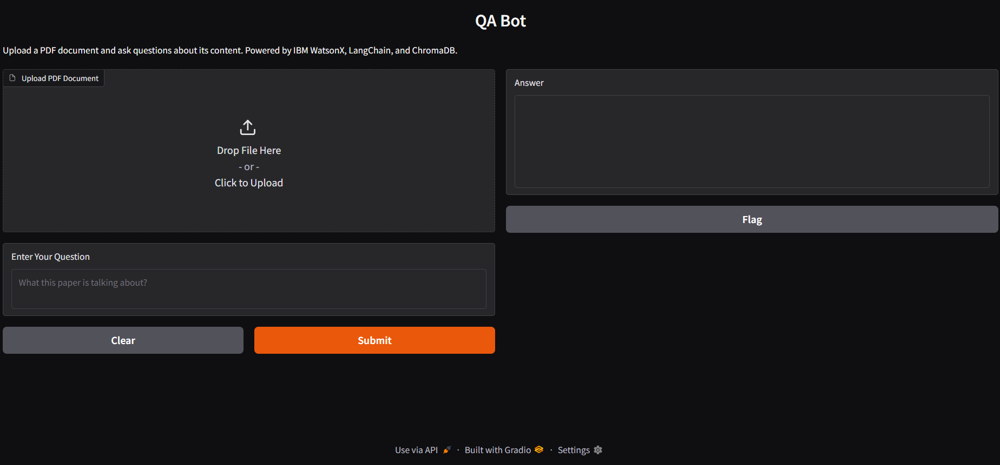

***FINAL ASSESSMENT: Generative AI: Introduction and Applications***\
*IBM*

## ASSESSMENT QUESTION
***SCENARIO***

- Imagine you work as a consultant for Quest Analytics, a small but fast-growing research organization.
- In today’s fast-paced research environment, the sheer volume of scientific papers can be overwhelming, making it nearly impossible to stay up-to-date with the latest developments. 
- The researchers at Quest Analytics have been struggling to find the time to examine countless documents, let alone extract the most relevant and insightful information. 
- You have been hired to build an AI RAG assistant that can read, understand, and summarize vast amounts of data, all in real time. Follow the below tasks to construct the AI-powered RAG assistant to optimize the research endeavors at Quest Analytics.

***Project Tasks and Deliverables***

All the following tasks are to be completed based on the lab “Construct a QA Bot that Leverages LangChain and LLM to Answer Questions from Loaded Documents.” 

For all tasks, you may use the LLM mistralai/mixtral-8x7b-instruct-v01 sourced from the watsonx.ai API. 

**Task 1: Load document using LangChain for different sources (10 points)**
- Capture a screenshot (saved as 'pdf_loader.png') that displays the code used.

**Task 2: Apply text splitting techniques (10 points)**
- Submit a screenshot (saved as ‘code_splitter.png’) that displays the code used

**Task 3: Embed documents (10 points)**
- Submit a screenshot (saved as ‘embedding.png’) that displays the code used.

**Task 4: Create and configure vector databases to store embeddings (10 points)**
- Submit a screenshot (saved as ‘vectordb.png’) that displays the code used to create a Chroma vector database that stores the embeddings of the document.

**Task 5: Develop a retriever to fetch document segments based on queries (10 points)**
- Submit a screenshot (saved as ‘retriever.png’) that displays the code used to develop a retriever to Fetch Document segments based on Queries.

**Task 6: Construct a QA Bot that leverages the LangChain and LLM to answer questions (10 points)**
- Submit a screenshot (saved as ‘QA_bot.png’) that displays the QA bot interface you created based on the lab “Construct a QA Bot That Leverages the LangChain and LLM to Answer Questions from Loaded Documents.” Also, the picture should display that you uploaded a PDF and are asking a query to the bot. 

#

The PDF you can use is in 'A_Comprehensive_Review_of_Low_Rank_Adaptation_in_Large_Language_Models_for_Efficient_Parameter_Tuning-1.pdf'.\
The query you can use is:
query = "What this paper is talking about?

